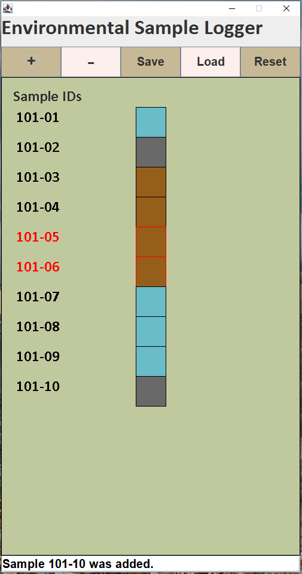
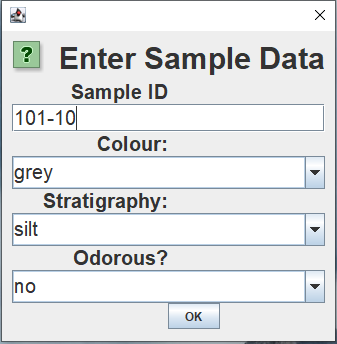

# EnvironmentalSampleLogger
An application which helps environmental consultants visualize the distribution of subsurface soil
when drilling boreholes. The user can create a new borehole location, and add samples specify
parameters such as colour, stratigraphy, and whether or not the sample is odourous. Save your
progress and come back to it later.

 

 